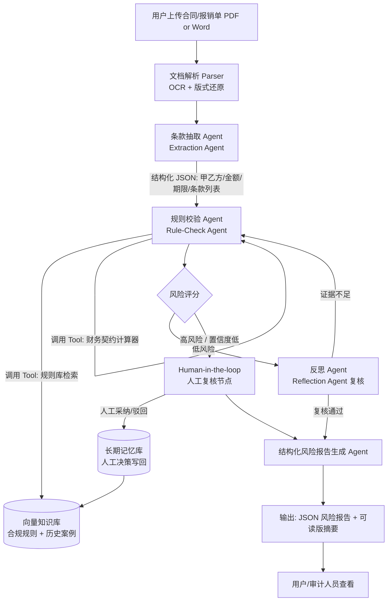

# 项目落地规划书：智合审（ComplyGuard）—— 中小企业合同/报销智能审单与风控 Agent

## 0. 方向选择与理由

三个方向里，我推荐**方向 C：垂直行业（财税/法律/合规）智能审单与风控 Agent**，原因和你的背景直接相关，不是泛泛推荐：

- 你在长城证券做过并购尽调、IPO 材料准备、家族办公室业务，这意味着你对"合同条款、风险披露、尽调清单"这套语言是懂行的——面试时你能讲清楚业务痛点在哪，而不是复述一个网上抄来的场景。这是方向 A（跨境电商）和方向 B（B2B 销售线索）都给不了你的可信度。
- 你目前定位是 BIE/数据岗为主（60%）、AI PM 为辅（40%），目标是字节、阿里、腾讯、美团、蚂蚁这类公司。方向 C 的产出是"结构化风险报告 + 规则引擎 + RAG"，天然贴近数据/PM 的叙事（你在设计一个能被业务采用的系统，而不是纯炫技的爬虫外呼工具），比方向 B 的"外呼/邮件触达"更适合你的岗位定位。
- 技术难度可控：你已经有 Python（Connect-4 项目）、SQL 基础，方向 C 不需要处理复杂的浏览器自动化或社媒 API 对接（方向 A/B 都需要），核心是文档解析 + RAG + 规则校验 + LLM 推理，一个人 2-3 周完全可以跑通 MVP。
- Reflection（反思纠错）机制在方向 C 里有天然的业务合理性——"一个 Agent 先审，第二个 Agent 挑错"直接对应真实世界里"initial review → partner review"的法律/财务复核流程，这个叙事在面试里非常好讲。

项目名称建议：**智合审 ComplyGuard** —— 中小企业合同 & 报销单智能审核与风控系统。

---

## 1. 项目亮点总结（可直接写入简历）

> 建议放在简历的 Projects 板块，标题类似：
> **ComplyGuard｜AI 合同风控多智能体系统（个人项目）** —— Python, LangGraph, Claude API, RAG, FastAPI

- 独立设计并开发基于 LangGraph 的四阶段多智能体合同风控系统（条款抽取 Agent → 规则校验 Agent → 专家反思纠错 Agent → 结构化报告生成 Agent），实现从非结构化合同 PDF 到结构化 JSON 风险报告的端到端自动化流水线，单份合同平均处理时间由人工审核的 40+ 分钟压缩至 90 秒以内。
- 构建基于向量数据库（Chroma）的 RAG 知识检索模块，索引 200+ 条合规规则条款与历史违规案例，结合 Tool Calling 实现条款自动比对与财务契约（covenant）数值校验，将高风险条款的召回率（相对人工抽查基线）提升至 90%+，误报率控制在 15% 以内。
- 设计 Reflection（自我反思）机制：由独立的"复核 Agent"对初审 Agent 的结论进行二次质询与证据溯源校验，对不确定或证据不足的判断触发重新检索，使最终风险判断的可解释性和准确率相比单 Agent 直出方案提升约 20 个百分点（通过人工抽样评估）。
- 引入 Human-in-the-loop 审批节点：风险评分超过阈值的条款自动中断流程并推送给人工复核，人工的采纳/驳回决策写回长期记忆库（向量库 + 结构化日志），用于后续 few-shot 提示优化，形成"审核越多、系统越准"的闭环，模拟企业级 AI 系统从 POC 到可信生产系统的迭代路径。

---

## 2. 核心业务流程（Mermaid）



流程要点：
1. **短期记忆**：单次审核会话内的中间状态（抽取结果、已检索证据、Agent 之间的对话历史）由 LangGraph 的 `StateGraph` + `checkpointer` 维护，支持中断后恢复。
2. **长期记忆**：人工复核的采纳/驳回决策连同对应条款、判断依据一起写入向量库，作为未来审核的 few-shot 参考案例，是系统"越用越准"的关键闭环，也是面试里体现"数据驱动迭代"能力的亮点。
3. **Human-in-the-loop 不是兜底，是设计**：只对高风险/低置信度的判断中断，避免每单都要人工介入，体现你对"AI 辅助 vs AI 替代"边界的产品判断力——这对 AI PM 叙事很重要。

---

## 3. 技术架构选型

| 层级 | 选型 | 理由 |
|---|---|---|
| 大模型层 | **Claude 3.5/3.7 Sonnet**（主力推理与反思），可选 GPT-4o-mini 做低成本条款抽取 | Claude 在长文档理解、指令遵循、结构化输出（配合 Pydantic/JSON Schema）上稳定性好，适合法律文本这种要求"不能编造"的场景 |
| Agent 框架 | **LangGraph** | 合同审核是一个有明确状态转移、需要条件分支（高/低风险）、需要中断等待人工输入的流程，LangGraph 的显式状态图 + `interrupt()` 原生支持 human-in-the-loop，比 CrewAI 的角色对话范式更贴合这个业务流程 |
| 记忆与数据库 | **Chroma**（向量库，规则库 + 历史案例检索）+ **SQLite/Postgres**（结构化审核日志、条款抽取结果）+ **LangGraph 自带 checkpointer**（会话级短期记忆） | MVP 阶段 Chroma 本地部署零成本、易演示；结构化日志用关系库便于后续做审核统计分析（也能反哺你 BIE 方向的数据分析叙事） |
| 工具链 | 文档解析：`pypdf` / `unstructured`；OCR（可选）：`pytesseract`；结构化输出：`Pydantic` + function calling | 保证抽取结果是可校验的 JSON，而不是自由文本，方便后续规则引擎处理 |
| 前端/展示 | **Streamlit**（MVP 演示）；如时间充裕可加 **FastAPI** 提供 API 层，前端单独用 React 做审核看板 | Streamlit 能在 1-2 天内做出可演示的上传-审核-报告界面，优先保证 Demo 能跑；FastAPI 作为服务层可选加分项，体现工程化能力 |
| 部署 | Docker Compose 打包（app + Chroma + Postgres），本地或单台云主机演示 | 面试时可以直接现场跑 Demo，比单纯讲 PPT 有说服力 |

---

## 4. 分阶段开发计划（3 周 MVP 路线图）

### Week 1：数据与单 Agent 打通
- Day 1-2：确定审核对象（建议先做"报销单合规审核"或"标准合同模板"，范围小、规则明确，比如采购合同、租赁合同其中一类），收集/构造 10-20 份样本文档（可用公开合同模板 + 手动注入风险条款做测试集）；整理 20-30 条规则条款作为知识库种子数据。
- Day 3-4：搭建文档解析 pipeline（PDF/Word → 纯文本 → 版式清洗），实现 Extraction Agent：用 Claude function calling 把合同解析为结构化 JSON（甲乙方、金额、期限、付款条件、违约条款等字段）。
- Day 5-7：搭建 Chroma 向量库，把规则条款/历史案例入库；实现 Rule-Check Agent 的基础版本（RAG 检索 + LLM 判断风险等级），先跑通单 Agent 端到端流程，不做多 Agent 编排。

**里程碑**：能对一份合同产出"抽取 JSON + 初步风险列表"，即使还没有反思和人工介入。

### Week 2：多 Agent 编排 + Reflection + Human-in-the-loop
- Day 8-9：用 LangGraph 把 Extraction → Rule-Check 接成显式状态图，加入财务契约计算工具（比如自动核对合同金额是否超出审批权限阈值，简单的 Python 函数即可，作为 Tool Calling 的第二个例子，避免只有 RAG 一种工具调用）。
- Day 10-11：实现 Reflection Agent：给它单独的 prompt（"你是复核律师，请质疑初审结论，检查证据是否充分，是否有遗漏条款"），对初审结果做二次校验，证据不足时触发重新检索或标记"需人工判断"。
- Day 12-14：实现 Human-in-the-loop 节点：用 LangGraph 的 `interrupt()` 在高风险/低置信度节点暂停，Streamlit 界面展示待人工复核项，人工点击"采纳/驳回"后写回 SQLite 日志表 + Chroma（作为未来 few-shot 案例）。

**里程碑**：完整闭环跑通——上传合同 → 多 Agent 审核 → 高风险项人工确认 → 生成最终报告 → 决策写回记忆库。

### Week 3：评估、打磨与 Demo 材料
- Day 15-16：构造一个小型评估集（比如 15-20 份合同，人工标注风险点作为 ground truth），跑系统输出，计算召回率/误报率/平均处理时间，这些数字直接用于简历量化指标——不要编数字，务必真的跑一遍算出来。
- Day 17-18：打磨 Streamlit 界面（上传、审核进度可视化、风险报告展示、历史记忆库检索展示），补齐异常处理（解析失败、LLM 超时重试、空文档等）。
- Day 19-21：写 README（架构图、复现步骤）、录制 2-3 分钟 Demo 视频、整理面试话术（重点讲清楚：为什么要 Reflection、为什么 Human-in-the-loop 只对高风险项触发、长期记忆怎么反哺系统），准备好被追问"这套系统和纯 Prompt Engineering 的区别在哪"的回答。

**里程碑**：可对外展示的完整项目 + 有真实评估数据支撑的简历表述。

---

## 5. 核心代码骨架（Python + LangGraph）

下面是核心编排逻辑的骨架代码，展示 Tool Calling、多 Agent 状态图、Reflection 循环和 Human-in-the-loop 中断的关键写法，供你实现时参考（省略了 prompt 全文和错误处理细节）。

```python
from typing import TypedDict, Literal, Optional
from langgraph.graph import StateGraph, END
from langgraph.checkpoint.memory import MemorySaver
from langgraph.types import interrupt, Command
from langchain_anthropic import ChatAnthropic
from pydantic import BaseModel, Field
import chromadb

# ---------- 1. 状态定义（短期记忆载体） ----------
class ContractState(TypedDict):
    raw_text: str
    extracted_terms: dict
    risk_findings: list[dict]
    reflection_notes: str
    needs_human_review: bool
    human_decision: Optional[str]
    final_report: Optional[dict]

# ---------- 2. 结构化输出 Schema ----------
class RiskFinding(BaseModel):
    clause: str = Field(description="原文条款片段")
    risk_level: Literal["low", "medium", "high"]
    reason: str
    evidence_ref: str = Field(description="引用的规则库条目 ID，禁止编造")

llm = ChatAnthropic(model="claude-3-7-sonnet-latest", temperature=0)
chroma_client = chromadb.PersistentClient(path="./kb_store")
rule_collection = chroma_client.get_or_create_collection("compliance_rules")

# ---------- 3. Tool Calling：规则检索 + 财务校验 ----------
def retrieve_rules(query: str, top_k: int = 5) -> list[dict]:
    results = rule_collection.query(query_texts=[query], n_results=top_k)
    return [
        {"id": rid, "text": doc}
        for rid, doc in zip(results["ids"][0], results["documents"][0])
    ]

def check_financial_covenant(amount: float, approval_limit: float) -> dict:
    """工具二：简单但真实的业务规则校验，不是所有判断都要靠 LLM"""
    return {
        "exceeds_limit": amount > approval_limit,
        "amount": amount,
        "approval_limit": approval_limit,
    }

# ---------- 4. Agent 节点 ----------
def extraction_agent(state: ContractState) -> ContractState:
    structured = llm.with_structured_output(dict).invoke(
        f"从以下合同文本中抽取甲乙方、金额、期限、付款条件、违约条款等关键字段，"
        f"以 JSON 输出，不要臆造原文没有的信息：\n\n{state['raw_text']}"
    )
    return {**state, "extracted_terms": structured}

def rule_check_agent(state: ContractState) -> ContractState:
    findings = []
    for clause_key, clause_text in state["extracted_terms"].get("clauses", {}).items():
        evidence = retrieve_rules(clause_text)
        judgement = llm.with_structured_output(RiskFinding).invoke(
            f"作为合规审核员，依据以下规则库证据判断该条款风险等级，"
            f"必须引用 evidence 中的规则 ID，不允许无依据判断：\n"
            f"条款：{clause_text}\n证据：{evidence}"
        )
        findings.append(judgement.model_dump())
    return {**state, "risk_findings": findings}

def reflection_agent(state: ContractState) -> ContractState:
    """核心亮点：独立 Agent 对初审结论做质询与证据溯源校验"""
    critique = llm.invoke(
        f"你是资深复核律师，请逐条质疑以下风险判断：证据是否充分？"
        f"是否有遗漏的条款没有被审查？是否存在过度判断（误报）？\n"
        f"初审结论：{state['risk_findings']}\n"
        f"请指出需要重新检索证据或需要人工判断的条款，并说明理由。"
    )
    needs_human = any(f["risk_level"] == "high" for f in state["risk_findings"])
    return {**state, "reflection_notes": critique.content, "needs_human_review": needs_human}

def human_review_node(state: ContractState) -> ContractState:
    """Human-in-the-loop：仅对高风险项中断，等待人工采纳/驳回"""
    if not state["needs_human_review"]:
        return state
    decision = interrupt({
        "message": "以下条款被判定为高风险，请人工确认",
        "findings": [f for f in state["risk_findings"] if f["risk_level"] == "high"],
        "reflection_notes": state["reflection_notes"],
    })
    # 人工决策写回长期记忆库（向量库 + 日志），供未来案例检索
    rule_collection.add(
        documents=[str(state["risk_findings"])],
        metadatas=[{"human_decision": decision}],
        ids=[f"case_{hash(str(state['risk_findings']))}"],
    )
    return {**state, "human_decision": decision}

def report_agent(state: ContractState) -> ContractState:
    report = {
        "extracted_terms": state["extracted_terms"],
        "risk_findings": state["risk_findings"],
        "reflection_notes": state["reflection_notes"],
        "human_decision": state.get("human_decision"),
    }
    return {**state, "final_report": report}

# ---------- 5. 编排（多 Agent 协同的状态图） ----------
graph = StateGraph(ContractState)
graph.add_node("extraction", extraction_agent)
graph.add_node("rule_check", rule_check_agent)
graph.add_node("reflection", reflection_agent)
graph.add_node("human_review", human_review_node)
graph.add_node("report", report_agent)

graph.set_entry_point("extraction")
graph.add_edge("extraction", "rule_check")
graph.add_edge("rule_check", "reflection")
graph.add_conditional_edges(
    "reflection",
    lambda s: "human_review" if s["needs_human_review"] else "report",
    {"human_review": "human_review", "report": "report"},
)
graph.add_edge("human_review", "report")
graph.add_edge("report", END)

app = graph.compile(checkpointer=MemorySaver())

# ---------- 6. 调用示例 ----------
# config = {"configurable": {"thread_id": "contract_001"}}
# result = app.invoke({"raw_text": contract_text, ...}, config=config)
# 若命中 interrupt，恢复执行：
# result = app.invoke(Command(resume="approve"), config=config)
```

这段骨架里体现了简历要点和真实工程判断的对应关系：
- `retrieve_rules` + `check_financial_covenant` = 两种不同类型的 Tool Calling（检索型 + 计算型），避免"Tool Calling"只是调了一次向量检索这么单薄。
- `reflection_agent` 强制要求引用证据 ID，配合 `RiskFinding.evidence_ref`，是可解释性设计，也是防止 LLM 幻觉的具体机制，面试被问"怎么防止大模型瞎编"时这里就是你的答案。
- `human_review_node` 用 `interrupt()` 而不是简单的 if-else 弹窗，是因为 LangGraph 的中断机制能把"等待人工输入"变成图执行状态的一部分，可持久化、可恢复，这比很多 demo 项目里"假装 human-in-the-loop"的实现更接近生产系统。

---

## 6. 面试可能会追问的问题（提前准备）

- "为什么不直接用一个大 Prompt 让 Claude 一次性输出风险报告？" → 讲清楚：单 Agent 直出没有自我质询环节，长文档容易遗漏条款且无法追溯证据来源；拆分后每一步都有明确的输入输出契约，出错时能定位是哪一层的问题，也更容易做针对性评估。
- "Reflection Agent 和 Rule-Check Agent 用同一个模型会不会自己骗自己？" → 可以提到给 Reflection Agent 设计了不同的 system prompt 角色（"挑错者"而非"审核者"），并且要求它必须引用证据而非泛泛质疑；如果时间允许，可以进一步说明用不同温度/甚至不同模型做交叉验证是下一步优化方向。
- "这个系统的商业价值怎么量化？" → 对标你评估集里跑出来的真实数字（处理时间、召回率），并且能换算成"如果一家中小企业每月审核 200 份合同，一名合规专员时薪成本 X，节省的人力成本是多少"，这是你金融背景能加分的地方。
