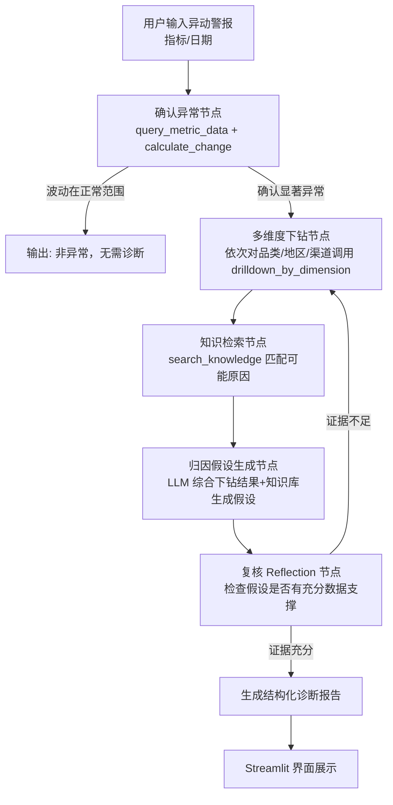

# 保姆级实操指南：经营异动诊断 Agent（零基础 Python + Agent 版）

> 写在最前面：我先看了一下 `PJ_with_Kerry` 文件夹里的内容——里面是 Kerry 老师"AI First 战略""Prompt Engineering""Monica 无代码 Agent"三节课的交付材料，核心是 **LangGPT 结构化提示词框架**（Role/Profile/Skills/Background/Goals/OutputFormat/Rules/Workflows）和"内容运营知识库"的范例结构，**不是**你项目描述里说的"业务指标字典、历史运营报表、异动排查手册"这类真实业务数据。这两者不冲突，反而是互补的：LangGPT 框架我们直接搬过来做 Agent 的 System Prompt 设计（这是你已经学过的东西，直接复用，不用再学一套新的），而"业务指标字典/历史报表/排查手册"这三份数据文件，本指南 Phase 2 会教你怎么从零构造出来（用真实电商公开数据集 + 手写排查手册），不是凭空要求你已经有。

---

## 0. 项目目标回顾

- **输入**：一个"指标异动警报"（比如：8 月 15 日 GMV 环比暴跌 23%）
- **输出**：一份结构化诊断报告——是哪个品类/地区/渠道导致的、大概率原因是什么、建议怎么处理
- **价值主张**：分析师手动下钻排查要 2 小时，Agent 1 分钟内自动完成第一轮归因

---

## 1. 项目核心技术栈与环境配置清单

### 1.1 需要安装的库

不用一次装全部，跟着 Phase 走，这里先给全貌，方便你知道每个库是干什么用的：

| 库 | 作用 | 为什么选它 |
|---|---|---|
| `langgraph` | Agent 工作流编排 | 把"思考→调工具→分析→输出"变成一个可视化的状态图，比自己手写 while 循环省心，出错也好定位是哪一步 |
| `langchain-anthropic` | 调用 Claude 模型 + 把 Python 函数包装成"工具" | 官方维护，和 langgraph 无缝配合 |
| `chromadb` | 向量数据库，存"排查手册/指标字典"这类文字知识 | 本地跑、零成本、不用装数据库服务，新手友好 |
| `sentence-transformers` | 把中文文本转成向量（Embedding），配合 Chroma 用 | 免费、本地跑、不用额外花 API 钱做 embedding，中文效果够用（用 `BAAI/bge-small-zh-v1.5` 模型） |
| `pandas` | 读表格数据、算涨跌幅、按维度聚合 | 你在 BUS AN 511/512 已经用过，不用重新学 |
| `streamlit` | 做最终演示界面 | 几十行代码就能有一个网页，不需要懂前端 |
| `python-dotenv` | 管理 API Key，不把密钥写死在代码里 | 基本工程规范，面试也会问你怎么管理密钥 |
| `pydantic` | 定义"诊断报告"这种结构化数据的格式 | 保证 Agent 输出的是规规矩矩的 JSON，不是随便一段话 |

### 1.2 本地环境搭建（Mac/Windows 通用步骤）

```bash
# 1. 确认 Python 版本（需要 3.10 及以上）
python3 --version

# 2. 在项目文件夹里建一个虚拟环境（避免污染系统 Python）
cd ~/Desktop/PJ_with_Kerry
mkdir op-anomaly-agent && cd op-anomaly-agent
python3 -m venv venv

# 3. 激活虚拟环境
# Mac/Linux:
source venv/bin/activate
# Windows (PowerShell):
# venv\Scripts\Activate.ps1

# 4. 安装依赖
pip install langgraph langchain-anthropic chromadb sentence-transformers pandas streamlit python-dotenv pydantic

# 5. 验证安装成功
python3 -c "import langgraph, langchain_anthropic, chromadb, pandas, streamlit; print('全部安装成功')"
```

看到终端打印出 `全部安装成功` 就说明环境没问题，看到任何 `ModuleNotFoundError` 就重新执行对应的 `pip install`。

### 1.3 API Key 配置

1. 打开 https://console.anthropic.com/ 注册/登录，进入 API Keys 页面，创建一个新 Key（形如 `sk-ant-...`）。
2. 在 `op-anomaly-agent` 文件夹根目录新建一个文件，命名为 `.env`：
   ```
   ANTHROPIC_API_KEY=sk-ant-你的真实密钥
   ```
3. **重要**：新建一个 `.gitignore` 文件，写入一行 `.env`，防止以后传到 GitHub 上密钥泄露（面试官如果看你的代码仓库，这也是一个"工程规范"加分项）。
4. 写一个最小验证脚本 `test_api.py`：
   ```python
   import os
   from dotenv import load_dotenv
   from langchain_anthropic import ChatAnthropic

   load_dotenv()
   llm = ChatAnthropic(model="claude-3-5-sonnet-latest")
   response = llm.invoke("用一句话介绍你自己")
   print(response.content)
   ```
   运行 `python3 test_api.py`，能看到 Claude 的回复文字，说明 API 打通了。这一步卡住的话，99% 是 `.env` 文件路径不对或 Key 复制少了字符，重新检查。

**成功标准（Phase 0 完成标志）**：`test_api.py` 能正常跑出 Claude 的回复。

---

## 2. 本地文件与数据准备方案

### 2.1 你需要准备的三类"数据资产"

前面说过，Kerry 的课件里没有现成的业务数据，我们要自己造三份东西。不要觉得"造数据"是在作弊——**真实企业项目里，用历史数据 + 领域知识构造一个可信的测试环境本身就是数据分析师/BIE 的基本功**，这一步在简历里完全可以写成"设计并构造了模拟经营数据集用于系统验证"。

| 文件 | 内容 | 用途 |
|---|---|---|
| `sales_data.csv` | 每日、分品类/地区/渠道的 GMV、订单数、客单价、退货率等结构化数据 | 给 Agent 的"查数工具"用，**不进向量库**，走 pandas 查询 |
| `metric_dictionary.md` | 每个指标的定义、计算口径、正常波动范围 | 进向量库，Agent 判断"这个波动算不算异常"时检索 |
| `troubleshooting_playbook.md` | 历史上各种异动的常见原因和排查思路（促销、系统故障、季节性、竞品动作、物流问题等） | 进向量库，Agent 生成"归因假设"时检索参考 |

### 2.2 sales_data.csv 怎么来

两个选择，任选一个：

**方案 A（推荐，更省事）**：用 Kaggle 上的公开电商数据集，比如 "Online Retail II" 或 "Brazilian E-Commerce (Olist)" 数据集，下载后用 pandas 清洗聚合成"日期 × 品类 × 地区 × 渠道"的粒度。这样你的数据是真实的，故事也讲得通（"基于公开电商数据集构造了模拟经营场景"）。

**方案 B**：手写一个 Python 脚本生成模拟数据，故意在某一天注入一个"异动"（比如某地区某渠道 GMV 突然跌 40%），方便你验证 Agent 能不能找到这个"埋的雷"。这是新手更容易操作的方式，也更容易设计"标准答案"来评估 Agent 判断得准不准。示例脚本：

```python
import pandas as pd
import numpy as np

np.random.seed(42)
dates = pd.date_range("2026-06-01", "2026-08-31")
categories = ["3C数码", "服饰", "美妆", "家居", "食品"]
regions = ["华东", "华南", "华北", "西南"]
channels = ["APP", "小程序", "线下门店"]

rows = []
for d in dates:
    for c in categories:
        for r in regions:
            for ch in channels:
                base_gmv = np.random.normal(loc=50000, scale=8000)
                rows.append({"date": d, "category": c, "region": r, "channel": ch, "gmv": max(base_gmv, 1000)})

df = pd.DataFrame(rows)

# 人为注入一次异动：8月15日，华南地区、APP渠道、美妆品类 GMV 暴跌 45%（模拟一次APP支付故障）
mask = (df["date"] == "2026-08-15") & (df["region"] == "华南") & (df["channel"] == "APP") & (df["category"] == "美妆")
df.loc[mask, "gmv"] = df.loc[mask, "gmv"] * 0.55

df.to_csv("sales_data.csv", index=False)
print("生成完成，共", len(df), "行")
```

跑完这个脚本，你就有了一份"埋好雷"的测试数据集，后面验证 Agent 能不能自己找到"8月15日、华南、APP、美妆"这个组合就是你的评估标准。

### 2.3 metric_dictionary.md 和 troubleshooting_playbook.md 怎么写

这两份是纯文本 Markdown，你自己写（也可以让 Claude 帮你打草稿，你再修改）。给你一个最小样例作为起点，实际项目里建议扩到 15-20 条：

`metric_dictionary.md` 片段示例：
```markdown
## GMV（成交总额）
- 定义：统计周期内，用户下单且未取消的订单金额总和（含优惠前金额）
- 计算口径：按下单时间统计，不按支付时间统计
- 正常日波动范围：环比 ±15% 以内属于正常波动
- 超过 ±25% 视为需要人工关注的异动

## 退货率
- 定义：退货订单数 / 总订单数
- 正常范围：3%-8%
- 超过 12% 视为异常
```

`troubleshooting_playbook.md` 片段示例：
```markdown
## 常见异动原因排查手册

### 1. 大促/活动效应
- 特征：GMV 短时间内大幅上涨，订单量同步上涨，客单价可能下降（因为低价引流款占比高）
- 排查方法：核对当天是否有满减、秒杀等活动配置

### 2. 系统/支付故障
- 特征：单一渠道（如APP）GMV 骤降，但其他渠道正常；订单数骤降但没有对应的流量下降
- 排查方法：检查当天技术侧是否有故障工单、支付成功率是否异常

### 3. 季节性/周期性波动
- 特征：波动幅度和去年同期/上周同一天接近
- 排查方法：对比历史同期数据，如果规律一致则不算真异常
```

### 2.4 怎么把这两份文档变成 RAG 知识库

```python
import chromadb
from sentence_transformers import SentenceTransformer

# 用本地免费的中文 embedding 模型，不用花 API 钱
embed_model = SentenceTransformer("BAAI/bge-small-zh-v1.5")

client = chromadb.PersistentClient(path="./kb_store")
collection = client.get_or_create_collection("op_knowledge")

def load_and_chunk(filepath: str, chunk_size: int = 300) -> list[str]:
    """极简版按段落切分，够用即可，不用一开始就上复杂的 chunking 策略"""
    text = open(filepath, encoding="utf-8").read()
    paragraphs = [p.strip() for p in text.split("\n\n") if p.strip()]
    return paragraphs

docs = load_and_chunk("metric_dictionary.md") + load_and_chunk("troubleshooting_playbook.md")
embeddings = embed_model.encode(docs).tolist()

collection.add(
    documents=docs,
    embeddings=embeddings,
    ids=[f"doc_{i}" for i in range(len(docs))],
)
print(f"知识库构建完成，共 {len(docs)} 条片段")
```

**成功标准（Phase 2 完成标志）**：`sales_data.csv` 有埋好的异动数据；两份 Markdown 文档写好；跑完上面的脚本后，`kb_store` 文件夹里生成了向量数据库文件。

---

## 3. Agent 核心工具链设计

这一步是整个项目的技术核心：**不要让 LLM "凭感觉"编数字，所有涉及计算和查数的地方必须走 Python 函数**，LLM 只负责"决定调用哪个工具、怎么解读结果"。

### 3.1 四个核心工具

| 工具名 | 作用 | 输入 | 输出 |
|---|---|---|---|
| `query_metric_data` | 按维度查询/聚合指标数据 | 指标名、日期、可选的维度筛选（品类/地区/渠道） | 聚合后的数值 |
| `calculate_change` | 计算涨跌幅、判断是否显著异常 | 当前值、基线值（比如前7天均值） | 涨跌幅百分比 + 是否超阈值 |
| `drilldown_by_dimension` | 按某个维度下钻，找出贡献最大的子项 | 指标名、日期、下钻维度（品类/地区/渠道之一） | 按该维度排序的贡献列表 |
| `search_knowledge` | 检索指标字典/排查手册 | 自然语言问题 | 相关文档片段 |

### 3.2 Python 实现

```python
import pandas as pd

df = pd.read_csv("sales_data.csv", parse_dates=["date"])

def query_metric_data(metric: str, date: str, category: str = None,
                       region: str = None, channel: str = None) -> float:
    """查询指定日期、指定维度筛选下的指标聚合值"""
    subset = df[df["date"] == date]
    if category:
        subset = subset[subset["category"] == category]
    if region:
        subset = subset[subset["region"] == region]
    if channel:
        subset = subset[subset["channel"] == channel]
    return float(subset[metric].sum())

def calculate_change(current_value: float, baseline_value: float, threshold_pct: float = 15.0) -> dict:
    """计算涨跌幅，判断是否超过异常阈值"""
    if baseline_value == 0:
        return {"change_pct": None, "is_anomaly": False}
    change_pct = round((current_value - baseline_value) / baseline_value * 100, 2)
    return {
        "change_pct": change_pct,
        "is_anomaly": abs(change_pct) > threshold_pct,
    }

def drilldown_by_dimension(metric: str, date: str, dimension: str, baseline_days: int = 7) -> list[dict]:
    """按维度下钻，找出对指标异动贡献最大的子项"""
    target_date = pd.to_datetime(date)
    baseline_start = target_date - pd.Timedelta(days=baseline_days)

    current = df[df["date"] == target_date].groupby(dimension)[metric].sum()
    baseline = df[(df["date"] >= baseline_start) & (df["date"] < target_date)].groupby(dimension)[metric].sum() / baseline_days

    result = []
    for key in current.index:
        cur_val = current.get(key, 0)
        base_val = baseline.get(key, 0)
        change = calculate_change(cur_val, base_val, threshold_pct=0)  # 这里不设阈值，只看排序
        result.append({dimension: key, "current": cur_val, "baseline": round(base_val, 1), "change_pct": change["change_pct"]})

    # 按跌幅从大到小排序，最可能的"元凶"排在最前面
    result.sort(key=lambda x: x["change_pct"] if x["change_pct"] is not None else 0)
    return result

def search_knowledge(query: str, top_k: int = 3) -> list[str]:
    """检索知识库（指标字典 + 排查手册）"""
    query_embedding = embed_model.encode([query]).tolist()
    results = collection.query(query_embeddings=query_embedding, n_results=top_k)
    return results["documents"][0]
```

### 3.3 把这四个函数注册成 Claude 的 Tool（Function Calling）

用 `langchain_anthropic` 的写法，给每个函数配一个 docstring 和类型标注，LangChain 会自动帮你生成 Tool Schema：

```python
from langchain_core.tools import tool

query_metric_data_tool = tool(query_metric_data)
calculate_change_tool = tool(calculate_change)
drilldown_by_dimension_tool = tool(drilldown_by_dimension)
search_knowledge_tool = tool(search_knowledge)

tools = [query_metric_data_tool, calculate_change_tool, drilldown_by_dimension_tool, search_knowledge_tool]

llm_with_tools = ChatAnthropic(model="claude-3-5-sonnet-latest").bind_tools(tools)
```

**成功标准（Phase 3 完成标志）**：单独调用每个函数（不经过 LLM），手动传参数能跑出正确结果，比如 `drilldown_by_dimension("gmv", "2026-08-15", "region")` 能看到"华南"排在跌幅最大的位置——这是在验证你的数据和函数逻辑本身没问题，再往下接 Agent 才不会两边一起出错、无法排查。

---

## 4. 系统架构与工作流设计

### 4.1 通俗版流程说明

1. 用户在界面上填一个"异动警报"：指标 = GMV，日期 = 2026-08-15，观察到环比大跌
2. Agent 第一步：调用 `query_metric_data` 拿到当天总 GMV，调用 `calculate_change` 和过去 7 天均值对比，确认确实是"显著异常"（不是正常波动，那直接不用往下走）
3. Agent 第二步：依次按"品类""地区""渠道"三个维度调用 `drilldown_by_dimension`，找出每个维度里跌幅最大的子项
4. Agent 第三步：把"华南 + APP + 美妆"这类下钻结果组合起来，调用 `search_knowledge` 检索排查手册，匹配出"可能是系统/支付故障"这类假设
5. Agent 第四步（复核/Reflection）：检查生成的假设有没有"自说自话"——比如是否真的只有这个组合跌了、其他维度是否正常，避免把巧合当成因果
6. 输出结构化诊断报告：异动确认 + 归因路径 + 最可能原因 + 建议动作

### 4.2 Mermaid 流程图



### 4.3 LangGraph 实现骨架（复用你在 Kerry 课上学的 LangGPT 思路写 Prompt）

这里有个衔接点很重要：**你在 Monica 课上学的 Role/Profile/Skills/Rules/Workflows 这套 LangGPT 结构，在写代码里的 System Prompt 时同样适用**，不需要换一套新框架，只是从填在 Monica 网页里变成写在 Python 字符串里：

```python
SYSTEM_PROMPT = """
# Role: 经营异动诊断专家

## Profile
- description: 你是一名资深数据分析师，擅长通过多维度下钻定位业务指标异动的根因

## Skills
1. 判断一次波动是否属于需要关注的"显著异动"
2. 按品类/地区/渠道逐层下钻，定位贡献最大的子项
3. 结合业务知识库，把数据现象翻译成可能的业务原因
4. 输出结构清晰、有数据支撑、不臆测的诊断报告

## Rules
1. 所有数值结论必须来自工具调用结果，禁止自己编造数字
2. 归因假设必须有对应的下钻数据或知识库依据支撑，不能凭感觉猜测
3. 如果下钻后仍无法定位到具体维度，如实说明"未能定位到明确根因"，不要硬编一个

## Workflows
1. 先确认这是否是显著异动
2. 依次在品类、地区、渠道三个维度下钻，找到贡献最大的子项组合
3. 检索知识库，匹配该现象对应的常见原因
4. 输出结构化报告：异动确认结论、下钻路径、可能原因（附证据）、建议动作
"""

from typing import TypedDict
from langgraph.graph import StateGraph, END

class DiagnosisState(TypedDict):
    metric: str
    date: str
    messages: list
    drilldown_results: dict
    knowledge_snippets: list
    final_report: dict

def confirm_anomaly_node(state: DiagnosisState) -> DiagnosisState:
    current = query_metric_data(state["metric"], state["date"])
    baseline = sum(
        query_metric_data(state["metric"], d)
        for d in pd.date_range(end=state["date"], periods=8, closed="left").strftime("%Y-%m-%d")
    ) / 7
    change = calculate_change(current, baseline)
    state["drilldown_results"] = {"overall": change}
    return state

def drilldown_node(state: DiagnosisState) -> DiagnosisState:
    results = {}
    for dim in ["category", "region", "channel"]:
        results[dim] = drilldown_by_dimension(state["metric"], state["date"], dim)
    state["drilldown_results"].update(results)
    return state

def knowledge_search_node(state: DiagnosisState) -> DiagnosisState:
    top_suspect = state["drilldown_results"]["region"][0]  # 跌幅最大的那个
    query = f"{state['metric']} 在 {top_suspect} 出现大幅下跌的可能原因"
    state["knowledge_snippets"] = search_knowledge(query)
    return state

def report_node(state: DiagnosisState) -> DiagnosisState:
    prompt = f"{SYSTEM_PROMPT}\n\n下钻数据：{state['drilldown_results']}\n知识库参考：{state['knowledge_snippets']}\n请输出结构化诊断报告（JSON）。"
    response = llm_with_tools.invoke(prompt)
    state["final_report"] = {"raw": response.content}
    return state

graph = StateGraph(DiagnosisState)
graph.add_node("confirm_anomaly", confirm_anomaly_node)
graph.add_node("drilldown", drilldown_node)
graph.add_node("knowledge_search", knowledge_search_node)
graph.add_node("report", report_node)

graph.set_entry_point("confirm_anomaly")
graph.add_conditional_edges(
    "confirm_anomaly",
    lambda s: "drilldown" if s["drilldown_results"]["overall"]["is_anomaly"] else END,
    {"drilldown": "drilldown", END: END},
)
graph.add_edge("drilldown", "knowledge_search")
graph.add_edge("knowledge_search", "report")
graph.add_edge("report", END)

app = graph.compile()
```

**成功标准（Phase 3 完成标志，紧接工具链之后）**：`app.invoke({"metric": "gmv", "date": "2026-08-15", ...})` 能跑完整个流程，最后 `final_report` 里能看到提到"华南""APP""美妆"这些关键词——说明 Agent 真的找到了你 Phase 2 埋的那颗雷,而不是随便编了一个原因。

---

## 5. UI 与最终产出形态

### 5.1 交付物形态

一个 Streamlit 单页应用，本地跑 `streamlit run app.py` 就能在浏览器打开，不需要部署服务器（面试展示时直接现场跑）。

### 5.2 界面元素清单

| 区域 | 元素 | 说明 |
|---|---|---|
| 侧边栏 | 数据源信息展示（当前用的是 sales_data.csv，行数、日期范围） | 让人一眼知道数据来源是真实还是模拟 |
| 主区域顶部 | 指标下拉框（GMV/客单价/退货率）+ 日期选择器 + "开始诊断"按钮 | 输入异动警报 |
| 主区域中部 | 一个可展开的日志区（`st.status` 或 `st.expander`），实时显示"正在确认异常...""正在下钻品类维度...""正在检索知识库..." | 模拟"流式对话框"效果，展示 Agent 的思考过程，这是演示时最能打动人的部分 |
| 主区域下部 | 结构化诊断报告卡片：用 `st.metric` 展示"异动幅度"，用 `st.bar_chart` 展示下钻结果，用 `st.warning`/`st.success` 高亮结论，最后一段文字给出"建议动作" | 最终交付形态 |

### 5.3 核心代码骨架

```python
import streamlit as st

st.set_page_config(page_title="经营异动诊断 Agent", layout="wide")
st.title("经营异动诊断 Agent")

with st.sidebar:
    st.markdown("**数据源**")
    st.write(f"共 {len(df)} 条记录，日期范围 {df['date'].min().date()} ~ {df['date'].max().date()}")

col1, col2, col3 = st.columns(3)
metric = col1.selectbox("选择指标", ["gmv"])
date = col2.date_input("异动日期")
run_button = col3.button("开始诊断", type="primary")

if run_button:
    with st.status("Agent 正在诊断中...", expanded=True) as status:
        st.write("① 确认是否为显著异动...")
        state = confirm_anomaly_node({"metric": metric, "date": str(date), "drilldown_results": {}})

        if not state["drilldown_results"]["overall"]["is_anomaly"]:
            status.update(label="判定：非显著异动", state="complete")
            st.success(f"波动幅度 {state['drilldown_results']['overall']['change_pct']}%，在正常范围内")
        else:
            st.write("② 按品类/地区/渠道下钻分析...")
            state = drilldown_node(state)
            st.write("③ 检索业务知识库匹配可能原因...")
            state = knowledge_search_node(state)
            st.write("④ 生成结构化诊断报告...")
            state = report_node(state)
            status.update(label="诊断完成", state="complete")

            st.metric("整体异动幅度", f"{state['drilldown_results']['overall']['change_pct']}%")
            st.bar_chart(pd.DataFrame(state["drilldown_results"]["region"]).set_index("region")["change_pct"])
            st.markdown("### 诊断报告")
            st.write(state["final_report"]["raw"])
```

**成功标准（Phase 4 完成标志）**：能在浏览器里选指标、选日期、点按钮，看到"思考过程"逐步展开，最后看到报告和图表——这就是你面试时现场演示的完整闭环。

---

## 6. 保姆级分阶段开发计划

### Phase 1：环境与工具编写（预计 3-4 天）

- **Day 1**：完成 1.2 环境搭建 + 1.3 API Key 配置，跑通 `test_api.py`。
  - 今天要写的代码：`test_api.py`
  - 成功标准：终端打印出 Claude 的回复文字
- **Day 2**：写 2.2 的模拟数据生成脚本，跑出 `sales_data.csv`，用 `df.head()` 和 `df[mask]` 肉眼确认埋的雷确实在数据里。
  - 今天要写的代码：`generate_data.py`
  - 成功标准：CSV 生成，且能用 pandas 筛出"8月15日+华南+APP+美妆"那一行，确认数值确实被压低了
- **Day 3**：写 metric_dictionary.md 和 troubleshooting_playbook.md（各 10-15 条）。
  - 今天要写的内容：两份 Markdown 文档
  - 成功标准：内容能覆盖你数据里可能出现的几种异动类型（故障、大促、季节性）
- **Day 4**：写 3.2 的四个工具函数，逐个手动调用测试（不接 LLM）。
  - 今天要写的代码：`tools.py`
  - 成功标准：`drilldown_by_dimension` 能正确找出"华南"排在最前面

### Phase 2：知识库与数据对接（预计 2-3 天）

- **Day 5**：写 2.4 的 embedding + Chroma 入库脚本，跑通后用一个测试查询验证检索效果。
  - 今天要写的代码：`build_kb.py`
  - 成功标准：`search_knowledge("APP渠道GMV骤降可能是什么原因")` 能检索到"系统/支付故障"那一条
- **Day 6-7**：把 `query_metric_data`、`calculate_change` 也接入真实数据跑一遍完整链路（手动按顺序调用，还没接 LangGraph），确认每一步数据流转正确。
  - 成功标准：手动串联四个函数，能人工拼出"华南+APP+美妆跌了45%，历史上这类情况多为系统故障"这样一句话结论

### Phase 3：Agent 编排与调试（预计 4-5 天）

- **Day 8-9**：搭建 4.3 的 LangGraph 状态图，先只跑 `confirm_anomaly_node` 和 `drilldown_node` 两个节点，print 每一步的 state 确认没问题。
  - 今天要写的代码：`graph.py`（先写两个节点）
  - 成功标准：`app.invoke(...)` 能跑到 drilldown 完成，state 里能看到三个维度的下钻结果
- **Day 10**：接入 `knowledge_search_node`，确认检索出来的知识片段和下钻出来的"元凶维度"是匹配的。
  - 成功标准：knowledge_snippets 里出现和"华南/APP"现象相关的排查手册条目
- **Day 11-12**：接入 `report_node`，调试 System Prompt 让输出稳定成结构化 JSON（这里会反复调，正常现象，prompt 调优本来就是要多试几轮）。
  - 成功标准：连续跑 5 次，`final_report` 都能稳定包含"归因维度""可能原因""建议动作"三个部分，不出现幻觉数字

### Phase 4：Streamlit UI 封装（预计 2-3 天）

- **Day 13**：按 5.3 骨架写出基础界面，先保证按钮点了之后有反应（哪怕报告展示很粗糙）。
  - 今天要写的代码：`app.py`
  - 成功标准：`streamlit run app.py` 能在浏览器打开，选指标+日期+点按钮能触发流程
- **Day 14**：加上 `st.status` 的分步展示、`st.bar_chart` 图表、报告卡片美化。
  - 成功标准：演示效果达到"能让没学过技术的人也看懂 Agent 在干什么"的程度
- **Day 15（缓冲/打磨）**：整理 README、录一段 2 分钟演示视频、准备面试话术（重点讲清楚"为什么要下钻"和"为什么用 Reflection 而不是一次性让 LLM 出结论"）。
  - 成功标准：能在 5 分钟内给别人完整讲清楚这个项目从数据到架构到价值

---

## 附：和方向 C（ComplyGuard 合同风控）对比一句话总结

这个项目更贴近你 BIE 岗位定位，技术门槛也确实比 ComplyGuard 低一档（不用处理 PDF 解析、不用那么严苛的证据溯源要求），但只要你按本指南把"下钻归因 + 知识库匹配"这个核心逻辑做扎实，价值完全不打折——两个项目可以都做，一个体现"业务分析自动化"能力，一个体现"高风险场景下的严谨 Agent 设计"能力，组合起来面试叙事更完整。
